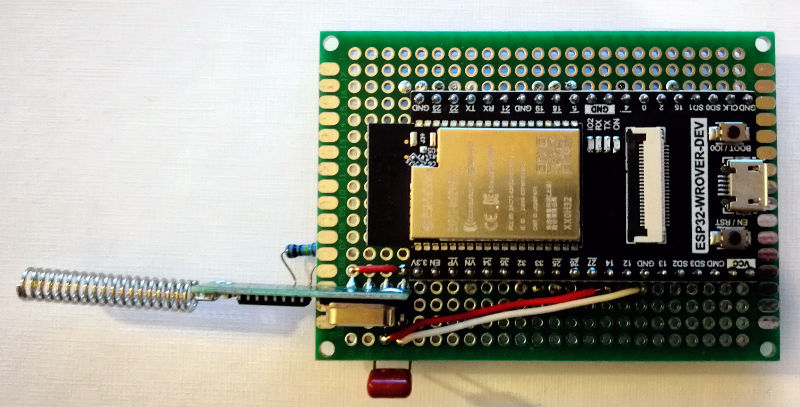
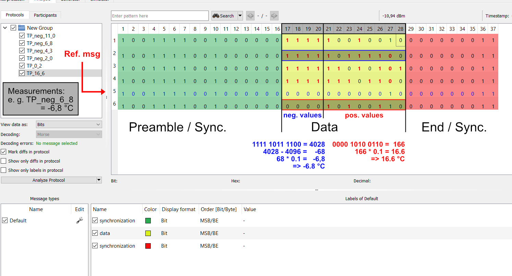

# TP65S-receiver-mpy

## Description

Receive temperature data with MicroPython from ThermoPro TP65s outdoor temperature sensor with the RX470C-V01 module.
The RX470C-V01 module is a low cost (~2 €) 433 MHz receiver for use with microcontrollers (MCUs).

## Hardware Setup
The RX470C-V01 module (RX) only needs one GPIO pin for data transmission.
It can be supplied with either 5V or 3.3V.
RX has two identical digital output (DO) pins, either of them may be used.

Exemplary connections:
- RX_GND --> MCU_GND
- RX_VCC --> MCU_3V3
- RX_DO  --> MCU_GPIO14

The program was tested on a Raspberry Pi Pico and on an Esp32-WROVER-B running MicroPython v1.23.0.

## Decoding the RF Protocol of the ThermoPro Temperature Sensor
A HackRF and UniversalRadioHacker were used to analyze the RF protocol of the outdoor temperature sensor.
The outdoor temperature sensor periodically transmitts temperature data to the indoor base station using on-off-keying (OOK) on 433 MHz.

Data is encoded similar to a morse encoding with alternating high and low pulses. 
Data is transmitted periodically every 50s.
High pulses have fixed durations of ~500 µs followed by low pulses with durations of either 2000 µs or 4000 µs, encoding 0 and 1, respectively.
A transmission is repeated six times seperated by a 8800 µs gap low pulse between each data transmission.
    
Each message consists of 37 high and low pulses + gap:
- Bit 1- 16: Preamble / Sync. = '1001111001000000'
- Bit 17 - 28: Data = 12 Bit
- Bit 29 - 37: End Sequence = '000000011' + gap

Decode the data:
- Temperaturs above 0 °C: Convert binary data to decimal number and divide by 10.
    - E. g. '000010100110' --> 166 --> 16,6 °C
- Temperature below 0 °C: Convert binary data to decimal number, subtract 4096 and divide by 10.
    - E. g. '111110111100' --> 4028 -->  4028 - 4096 = -68 --> -6,8°C

The figure shows measured signals of the outoor sensor at different temperatures and the received binary data.

## Acknowledgement
Parts of the signal decoding function are based on Peter Hinch's [micropython_remote](https://github.com/peterhinch/micropython_remote) RX class provided under MIT license.
