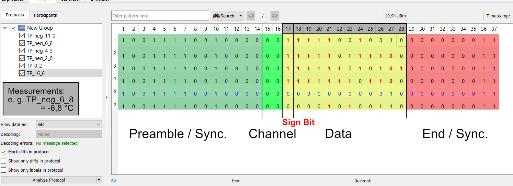

# TP65S-receiver-mpy

## Description

> [!TIP]
> I recommend [these steps](https://github.com/de-dh/MPY-RF) to optimize reception if you are using a RX470C RF receiver module.
> Other receivers were not tested.

This programm allows the reception of temperature data from a **ThermoPro TP65s** outdoor temperature sensor using **MicroPython**.
The TP sensor transmitts it's data via the 433 MHz ISM Band which can be aquired using a RX470C-V01 receiver.
The **RX470C-V01** module is a low cost (~2 €) 433 MHz receiver for use with microcontrollers (MCUs).
The program was tested on a **Raspberry Pi Pico** and on an **Esp32-WROVER-B** running MicroPython v1.23.0.

## Changelog

Changes in V2:
- Changing source address of the transmitter during reset is taken into account. I think it is generated by a LFSR.
- Channel is detected (Ch. 1 - 3).
- Data from a second, temperature transmitter (unknown brand) with a similar protocol can be received.

To Do:
- Identify low-power indicator bit of the transmitter. A battery charge lasts over a year so I couldn't identify it yet.

## Hardware Setup
The RX470C-V01 module (RX) only needs one GPIO pin for communication with the MCU.
It can be supplied with either 5V or 3.3V.
RX has two identical digital output (DO) pins, either of them may be used.

Exemplary connections:
- RX_GND --> MCU_GND
- RX_VCC --> MCU_3V3
- RX_DO  --> MCU_GPIO14

## Decoding the RF Protocol of the ThermoPro Temperature Sensor
A HackRF and UniversalRadioHacker were used to analyze the RF protocol of the ThermoPro TP65s outdoor temperature sensor (refferred to as _TP sensor_ in the following).
The TP sensor periodically transmitts temperature data to the indoor base station using on-off-keying (OOK) on the 433 MHz band.

The data is transmitted similar to a morse encoding with alternating high and low pulses.
Each bit is encoded by a high pulse and a low pulse.
High pulses have fixed durations of ~500 µs followed by low pulses with durations of either 2000 µs or 4000 µs, encoding 0 and 1, respectively.
Each message consits of six similar transmissions of the data. 
The individual transmissions are seperated by a long low pulse (gap) with a duration of approx. 8800 µs.
Data is transmitted periodically every 50s.

OOK Protocol:
- Bit 0: HIGH 500 µs + LOW 2000 µs
- Bit 1: HIGH 500 µs + LOW 4000 µs
- Gap : LOW 8800 µs

Structure of the Transmissions:
- Bit 01 - 14: Transmitter Address (probably LFSR generated)
- Bit 15 - 16: Channel No (1 - 3)
- Bit 17 - 28: Data = 12 Bit
- Bit 29 - 37: End Sequence = '000000011'
- Gap

Decoding the Data:
- Data is encoded in the [two's complement format](https://en.wikipedia.org/wiki/Two%27s_complement) consisting of 12 bit.
- The decoded integer must be divided by ten to obtain the temperature.

Examples:
- Temperature above 0 °C: Convert binary data to decimal number and divide by 10.
    - E. g. `'000010100110' --> 166 --> 16,6 °C`
- Temperature below 0 °C: Convert binary data to decimal number, subtract 4096 (2^12) and divide by 10.
    - E. g. `'111110111100' --> 4028 -->  4028 - 4096 = -68 --> -6,8°C`

The figure shows measured signals of the outoor sensor at different temperatures and the received binary data.

## Acknowledgement
Parts of the signal decoding function are based on Peter Hinch's [micropython_remote](https://github.com/peterhinch/micropython_remote) RX class provided under MIT license.
